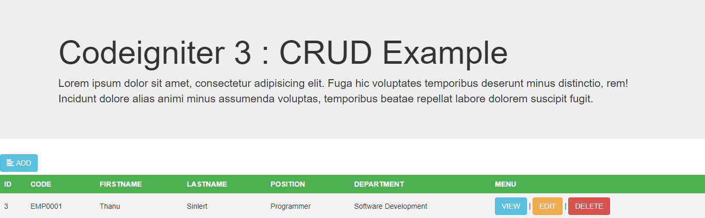

<p align="center">
</a>
</p>

# Codeigniter 3
> Demo นี้เป็นเพียงตัวอย่างและแนวทางในการทำ Create, Read, Update, Delete หรือ (CRUD) ข้อมูล 
โดยใช้ Codeigniter ซึ่งเป็น PHP Framework ที่ค่อนข้างเรียบง่าย, โค๊คสะอาดเป็นระเบียบ มีการแบ่งหน้าที่การทำงานตามแนวคิด MVC(Model-View-Controller)

### การติดตั้ง
#### 1. import ไฟล์  `cidemo.sql` ลงฐานข้อมูล

#### 2. ตั้งค่า user, password, database ที่  `application/config/database.php`

```
	$db['default'] = array(
		'dsn'	=> '',
		'hostname' => 'localhost',
		'username' => 'root',
		'password' => '',
		'database' => 'cidemo',
		'dbdriver' => 'mysqli',
		'dbprefix' => '',
		'pconnect' => FALSE,
		'db_debug' => (ENVIRONMENT !== 'production'),
		'cache_on' => FALSE,
		'cachedir' => '',
		'char_set' => 'utf8',
		'dbcollat' => 'utf8_general_ci',
		'swap_pre' => '',
		'encrypt' => FALSE,
		'compress' => FALSE,
		'stricton' => FALSE,
		'failover' => array(),
		'save_queries' => TRUE
	);
```

#### 3.เข้าตัวจำลอง Web Server เช่น xampp แล้วเข้าผ่าน localhost/ชื่อโปรเจ็ค
